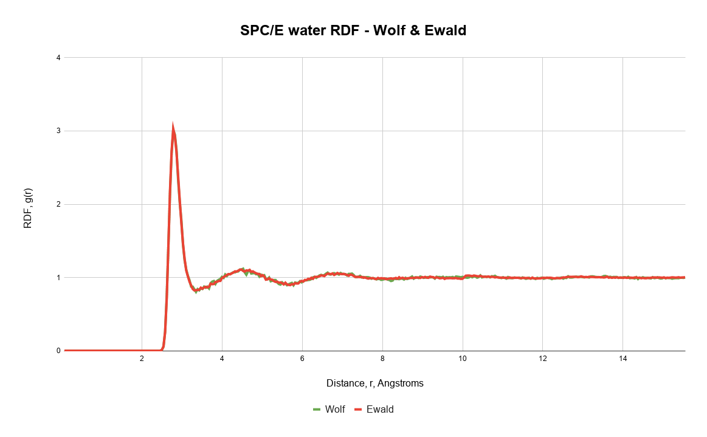
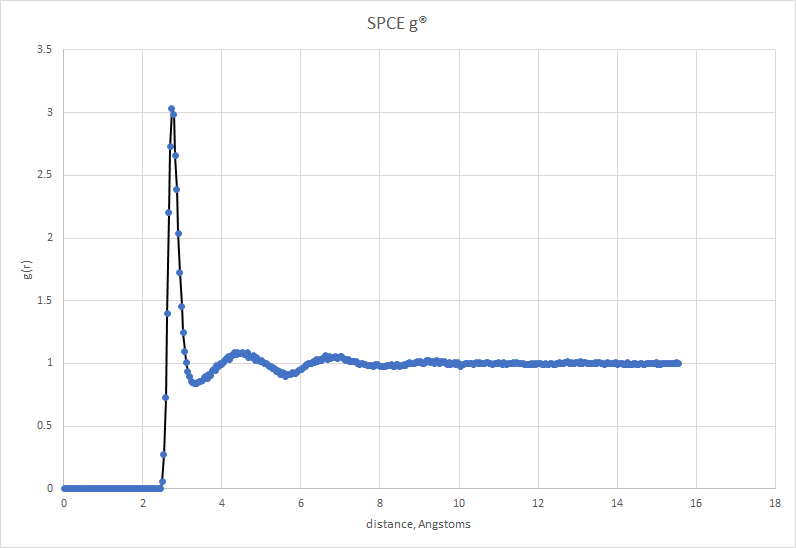
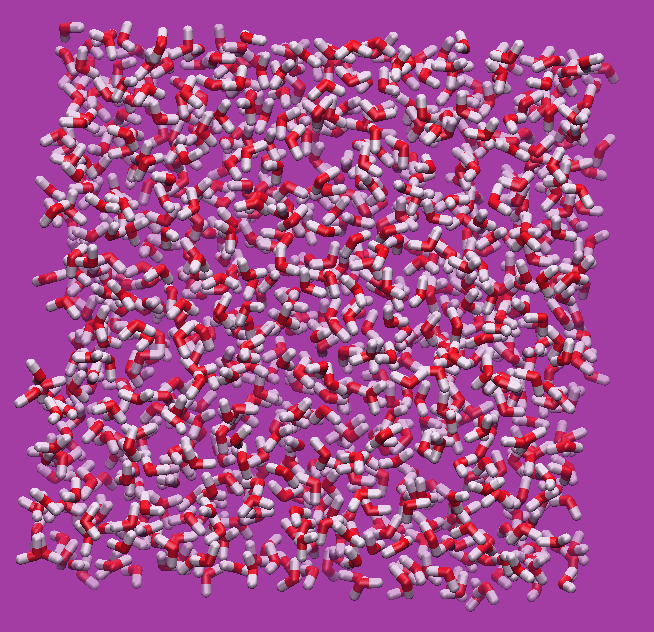

Implementation for rigid polyatomic Metropolis Monte Carlo

Currently implemented:

Ensembles:
  1. NVT

Electrostatics:
  1. Bare coulomb
  2. Wolf Summation
  3. Ewald Summation

TODO:
  1. Add pressure calculation
  2. Add NPT ensemble
  3. Add reaction ensemble (REMC)
  4. Add configurational Bias
  5. Add Grand Canonical MC
  6. Add Gibbs ensemble
  7. Add flexible force-fields and moves
  8. Add neighbor-list

Currently SPC/E works in the NVT ensemble (need to upload a proper plot of an rdf, not the cliche excel default)

There is lots of optimization needing to be done, lots of allocations being made. Need to make functions in place modifications rather than returning new arrays or values.

A simulation of 1000 SPC/E water molecules takes about 6 hours to do 10,000,000 monte carlo steps (translation + rotation). Pretty good for serial version. And again, code needs to be cleaned up, generalized and optimized. Lots to do.

