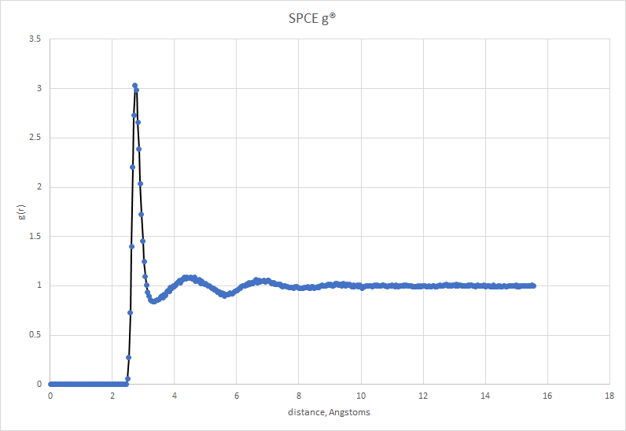

# Metropolis Monte Carlo
This is my playground which will be used for testing new ideas and algorithms. At the moment it has working rigid polyatomics with Ewald summation.

#Goals:
  1) add flexible molecules
  2) add force routines and provide molecular dynamics
  3) add free energy calculations
  4) add GPU support
  5) add ability to do adsorption
  
  # Proof of concept
  Here are some mediocre images to show it works :)

